实验一: 操作系统初步
====================

16281002 杜永坤 计科1601班

(注意：本次所有实验都在Linux中完成)

一、（系统调用实验）了解系统调用不同的封装形式。

要求：1、参考下列网址中的程序。阅读分别运行用API接口函数getpid()直接调用和汇编中断调用两种方式调用Linux操作系统的同一个系统调用getpid的程序(请问getpid的系统调用号是多少？linux系统调用的中断向量号是多少？)。2、上机完成习题1.13。3、阅读pintos操作系统源代码，画出系统调用实现的流程图。

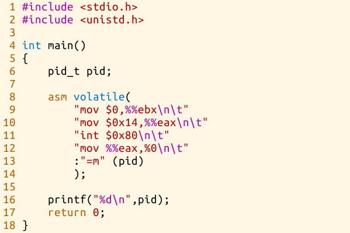

<http://hgdcg14.blog.163.com/blog/static/23325005920152257504165/>

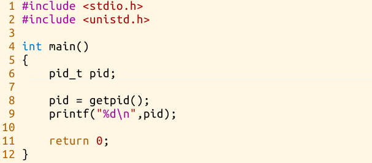

二、（并发实验）根据以下代码完成下面的实验。

要求：

1.  编译运行该程序（cpu.c），观察输出结果，说明程序功能。

>   (编译命令： gcc -o cpu cpu.c –Wall)（执行命令：./cpu）

2、再次按下面的运行并观察结果：执行命令：./cpu A & ; ./cpu B & ; ./cpu C & ;
./cpu D
&程序cpu运行了几次？他们运行的顺序有何特点和规律？请结合操作系统的特征进行解释。

~~~~~~~~~~~~~~~~~~~~~~~~~~~~~~~~~~~~~~~~~~~~~~~~~~~~~~~~~~~~~~~~~~~~~~~~~~~~~~~~
#include "stdio.h"
#include "unistd.h"

int main(){

    pid_t pid;
    pid = getpid();
    printf("%d\n",pid);

    return 0;
}
~~~~~~~~~~~~~~~~~~~~~~~~~~~~~~~~~~~~~~~~~~~~~~~~~~~~~~~~~~~~~~~~~~~~~~~~~~~~~~~~

~~~~~~~~~~~~~~~~~~~~~~~~~~~~~~~~~~~~~~~~~~~~~~~~~~~~~~~~~~~~~~~~~~~~~~~~~~~~~~~~
#include "stdio.h"
#include "unistd.h"

int main(){

    pid_t pid;

    asm volatile(
            "mov $0,%%ebx\n\t"
            "mov $0x14,%%eax\n\t"
            "int $0x80\n\t"
            "mov %%eax,%0\n\t"
            :"=m"(pid)  
            );
    printf("%d\n",pid);
    return 0;
}
~~~~~~~~~~~~~~~~~~~~~~~~~~~~~~~~~~~~~~~~~~~~~~~~~~~~~~~~~~~~~~~~~~~~~~~~~~~~~~~~

三、（内存分配实验）根据以下代码完成实验。

要求：

1.  阅读并编译运行该程序(mem.c)，观察输出结果，说明程序功能。(命令： gcc -o mem
    mem.c –Wall)

2、再次按下面的命令运行并观察结果。两个分别运行的程序分配的内存地址是否相同？是否共享同一块物理内存区域？为什么？命令：./mem
&; ./mem &

~~~~~~~~~~~~~~~~~~~~~~~~~~~~~~~~~~~~~~~~~~~~~~~~~~~~~~~~~~~~~~~~~~~~~~~~~~~~~~~~
#include <stdio.h>
#include <stdlib.h>
#include <sys/time.h>
#include <assert.h>
 int main(int argc, char *argv[])
 {
    if (argc != 2) {
    fprintf(stderr, "usage: cpu <string>\n");
    exit(1);
    }
    char *str = argv[1];
    while (1) {
        sleep(1);
        printf("%s\n", str);
    }
        return 0;
 } 
~~~~~~~~~~~~~~~~~~~~~~~~~~~~~~~~~~~~~~~~~~~~~~~~~~~~~~~~~~~~~~~~~~~~~~~~~~~~~~~~

四、（共享的问题）根据以下代码完成实验。

要求：

1.  阅读并编译运行该程序，观察输出结果，说明程序功能。（编译命令：gcc -o thread
    thread.c -Wall –pthread）（执行命令1：./thread 1000）

2.  尝试其他输入参数并执行，并总结执行结果的有何规律？你能尝试解释它吗？（例如执行命令2：./thread
    100000）（或者其他参数。）

3.  提示：哪些变量是各个线程共享的，线程并发执行时访问共享变量会不会导致意想不到的问题。

\`\`\`c \#include \<unistd.h\> \#include \<stdio.h\> \#include \<stdlib.h\>
\#include \<assert.h\>

int main(int argc, char *argv[]) { int* p = malloc(sizeof(int)); // a1 assert(p
!= NULL); printf("(%d) address pointed to by p: %p",getpid(), p); // a2 *p = 0;
// a3 while (1) { sleep(1 );* p = *p + 1; printf("(%d) p: %d", getpid(),* p); //
a4 } return 0; } \`\`\`

实验过程：
----------

一、（系统调用实验）了解系统调用不同的封装形式。

1、

运行用API接口函数getpid()直接调用：

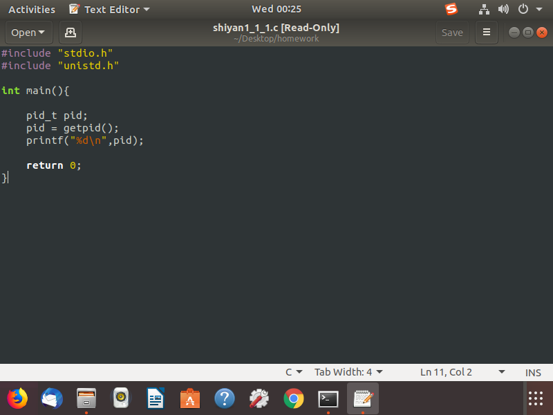

运行结果：

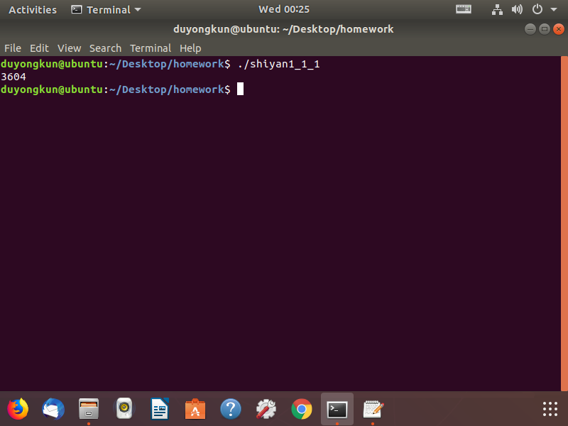

汇编中断调用两种方式调用Linux操作系统的同一个系统调用getpid的程序：

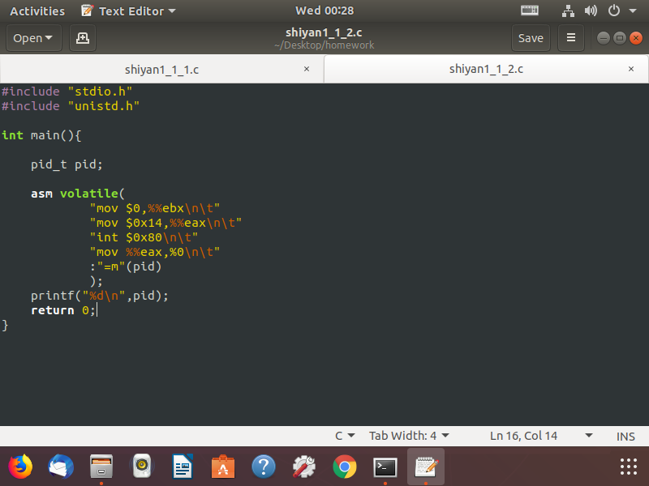

**运行结果：**

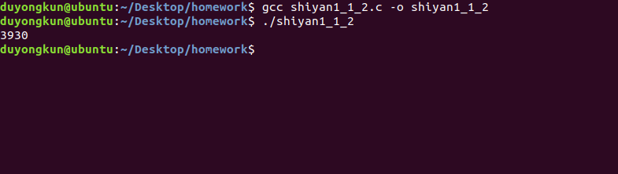

**从汇编程序可以看出getpid的是系统调用号为0x14，linux系统调用的中断向量号为0x80.**

**2、**

>   **1）linux的系统调用使用write函数。此函数有三个参数，第一个参数为1时是控制台输出。第三个参数是讲第二个参数的N个字符输出到控制台；在本次例子中Hello
>   World !\\n总共13字符。所以为13.**

~~~~~~~~~~~~~~~~~~~~~~~~~~~~~~~~~~~~~~~~~~~~~~~~~~~~~~~~~~~~~~~~~~~~~~~~~~~~~~~~
#include "stdio.h"
#include"stdlib.h"
#include <unistd.h>

int main()
{
write(1,"Hello World!\n",13);
return 0;
}
~~~~~~~~~~~~~~~~~~~~~~~~~~~~~~~~~~~~~~~~~~~~~~~~~~~~~~~~~~~~~~~~~~~~~~~~~~~~~~~~

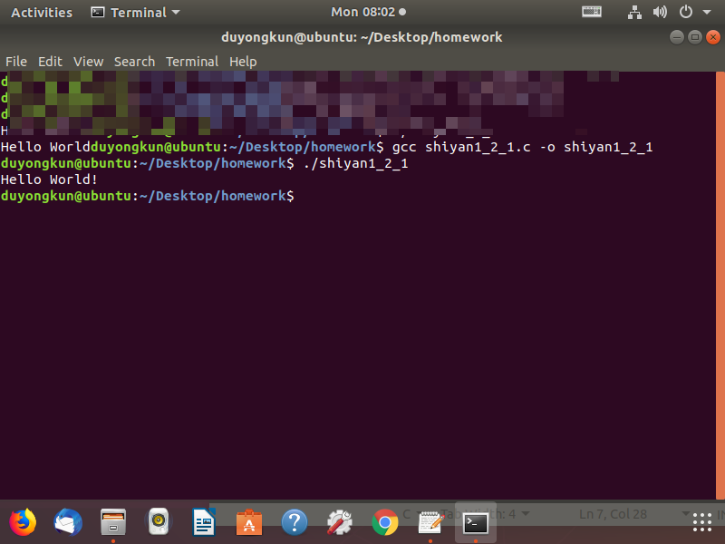

**2）使用汇编调用4号系统调用，对应的函数调用为sys_wirte, ssize_t write(int fd,
const void \*buf, size_t count);**

**参数 fd、buf 和 count 分别存在寄存器 ebx、ecx 和 edx 中，而系统调用号
SYS_write 则放在寄存器 eax 中，当 int 0x80 指令执行完毕后，返回值可以从寄存器
eax 中获得。**

**汇编代码：**

~~~~~~~~~~~~~~~~~~~~~~~~~~~~~~~~~~~~~~~~~~~~~~~~~~~~~~~~~~~~~~~~~~~~~~~~~~~~~~~~
.section .data #数据段声明 
msg: .ascii "hello world!\n" #要输出的字符串 
len=.-msg #字符串长度 
.section .text #代码段声明 
#.global main 
#main:
 .global _start #指定入口函数 
_start: #函数在屏幕上输出hello world! 
movl $len, %edx #第三个参数： 字符串长度 
movl $msg, %ecx #第二个参数： hello world!字符串 
movl $1, %ebx #第一个参数： 输出文件描述符 
movl $4, %eax #系统调用号sys_write 
int $0x80 #调用内核功能 #下面为退出程序代码 
movl $0, %ebx #第一个参数： 退出返回码
 movl $1, %eax #系统调用sys_exit 
int $0x80
~~~~~~~~~~~~~~~~~~~~~~~~~~~~~~~~~~~~~~~~~~~~~~~~~~~~~~~~~~~~~~~~~~~~~~~~~~~~~~~~

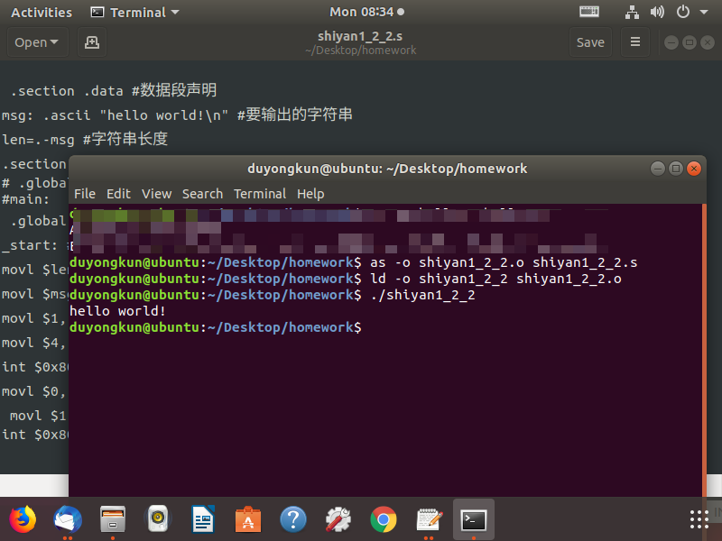

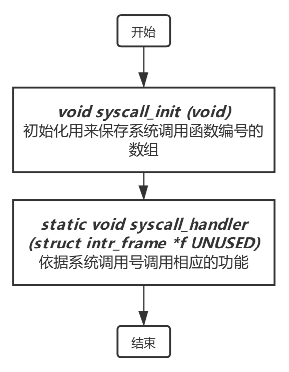

**3、pintos操作系统的系统调用的实现如下：**

**二、并发实验**

**1、程序功能：**

**在终端中运行 ./cpu 不带参数，在终端打印usage: cpu \<string\>**

**在终端中运行 ./cpu a 带string类型的参数（a），所以argc==2则打印
string类型的参数（a），argv参数为终端命令参数，例如 在终端输入 ./cpu A
，则argc[0]为第一个参数./cpu，argv[1]第二个参数为A，程序会循环打印第二个参数。**

**2、**

**运行结果：**

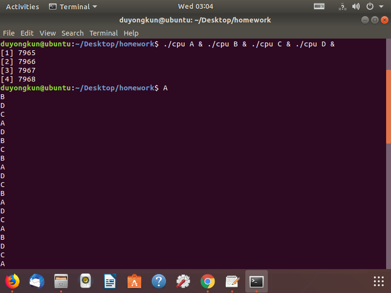

**程序运行时，可以看出，终端一次输出：四个字符，感觉是个程序同时在cpu中运行计算最后一同输出结果，这是四个程序并发运行的结果，四个程序在宏观上是一同运行的，微观上还是在cpu交替运行的，多道批处理系统中，I/O设备具有异步性，这个交替运行的顺序不确定，先进行的程序不一定是先结束，这就造成了这四个程序同时运行的时候，结束的顺序是不确定的，所以每次输出的时候，A\\B\\C\\D的顺序是不确定的。**

三、（内存分配实验）

**1、运行结果：**

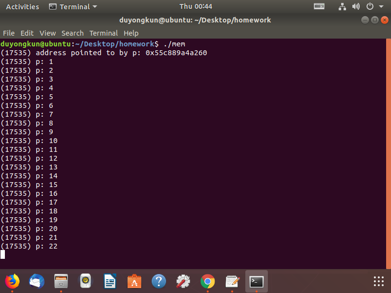

**程序功能：**

**该程序做了几件事。 首先，它分配一些内存。
然后，它打印出内存地址，然后将数字0放入新分配的内存的第一个位置。
最后，它循环：延迟一秒并递增存储在p中保存的地址的值。
对于每个print语句，它还会打印出正在运行的程序的进程标识符（PID）。
该PID在每个运行过程中都是唯一的。**

**2、**

**运行结果：**

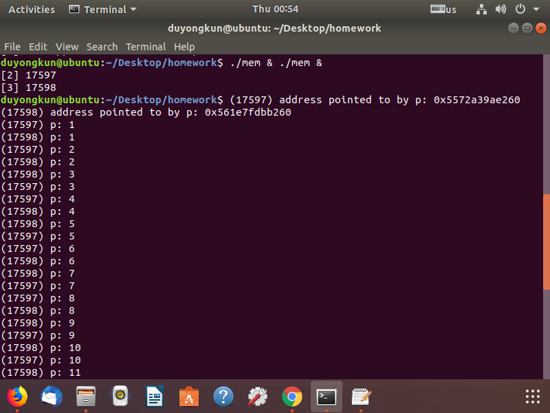

**结果分析：**

**每个正在运行的程序都在同一地址（0x5572a39ae260）分配了内存，但每个程序似乎都在独立更新0x5572a39ae260地址的值。
每个正在运行的程序都有自己的私有内存，而不是与其他正在运行的程序共享相同的物理内存。这是因为操作系统虚拟化了内存。
每个进程访问自己的私有虚拟地址空间（有时只称为其地址空间(address
space)），操作系统以某种方式映射到机器的物理内存。
一个正在运行的程序中的内存引用不会影响其他进程（或OS本身）的地址空间；就运行程序而言，它拥有所有的物理内存。
然而，现实是物理内存是由操作系统管理的共享资源。**

**两个程序共享了物理内存，因为操作系统虚拟化了内存，是的两个程序共享物理内存，但是每个程序都有私有虚拟地址空间。**

四、（共享的问题）

**1、**

**运行结果：**

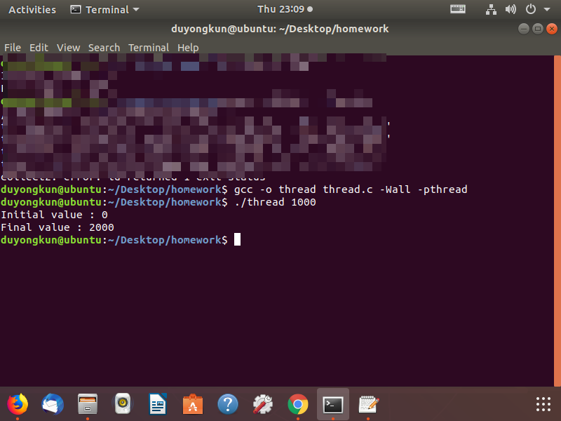

**程序功能：**

**主程序使用Pthread .create()创建两个线程。
可以将线程视为在与其他函数相同的内存空间中运行的函数，其中一次激活多个函数。
在这个例子中，每个线程开始在一个名为worker()的例程中运行，在该例程中，它只是循环递增一个统计循环次数的计数器。当两个线程完成时，计数器的最终值为2000，因为每个线程将计数器递增1000次。
当循环的输入值设置为N时，期望程序的最终输出为2N。**

**2、**

**尝试运行更多变量：**

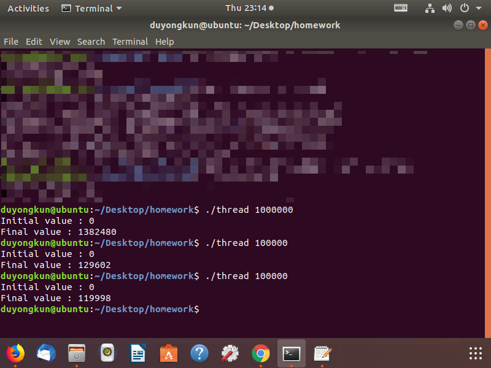

**由1可以得到，期望值应该是2000000、200000和200000但是结果并非如此，而且对100000这个变量有两个结果，结果也是不一样，结果输出并没有规律。**

**结果分析：**

**原因与指令的执行方式有关，一次一个。
不幸的是，上面程序的一个关键部分，共享计数器递增，需要三个指令：一个用于将计数器的值从存储器加载到寄存器中，一个用于递增它，一个用于将其存储回内存。
因为这三个指令不是原子地执行（一次全部执行），所以会发生奇怪的事情。**

**countor 、loops 这两个全局变量是被这两个线程共享的。**

**就如同2中发生的事情，当两个的线程并行执行的时候，共享全局变量countor
，虽然该变量的类型是volatile，是volatile它可能被意想不到地改变。volatile表明某个变量的值可能在外部被改变，优化器在用到这个变量时必须每次都小心地重新读取这个变量的值，而不是使用保存在寄存器里的备份。在编写多线程的程序时，同一个变量可能被多个线程修改，而程序通过该变量同步各个线程。**

**但是由于2中的原因存在，导致countor在内存中的值永远是不可意料，所以对于100000这个数据两次运行，得到的结果并不一样。**

github：https://github.com/Topdu/os/tree/master/homework/实验1 参考链接：
http://www.morecoder.com/article/1048513.html
https://blog.csdn.net/shallnet/article/details/45544271
