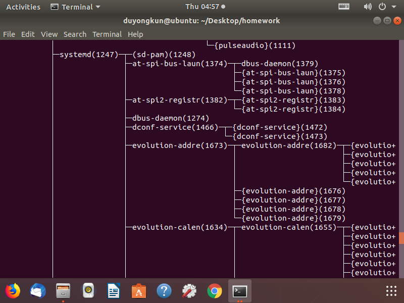

实验二 进程控制

16281002 杜永坤 计科1601

实验题目：
----------

根据课堂所学内容和基础知识介绍，完成实验题目。

#### 1、打开一个vi进程。通过ps命令以及选择合适的参数，只显示名字为vi的进程。寻找vi进程的父进程，直到init进程为止。记录过程中所有进程的ID和父进程ID。将得到的进程树和由pstree命令的得到的进程树进行比较。

实验过程：

先打开一个终端

输入vi 回车

进入到如下界面：


然后打开一个新的终端

输入 ps -ef

 ps    -ef            显示整个环境（主机）中所有进程详细信息


UID ：程序被该 UID 所拥有

PID ：就是这个程序的 ID

PPID ：则是其上级父程序的ID

C ：CPU使用的资源百分比

STIME ：系统启动时间

TTY ：登入者的终端机位置

TIME ：使用掉的CPU时间。

CMD ：所下达的是什么指令

然后寻找CMD为vi的进程


可以看到进程为1971 然后它的父进程为1776

可以得到

1972-1776-1770-1247-1

使用pstree -p

得到下面的进程树

可以看到所以的进程都是依附在systemd(1)这个进程下面，它的进程PID是1

然后systemd(1247)是它的一个子进程再往后依次为gnome-terminal-(1770)──bash(1776)───vi(1971)

可以看到与1972-1776-1770-1247-1符合




#### 2、编写程序，首先使用fork系统调用，创建子进程。在父进程中继续执行空循环操作；在子进程中调用exec打开vi编辑器。然后在另外一个终端中，通过ps –Al命令、ps aux或者top等命令，查看vi进程及其父进程的运行状态，理解每个参数所表达的意义。选择合适的命令参数，对所有进程按照cpu占用率排序。

>   根据实验要求编写代码：
```c
#include <stdio.h>
#include <stdlib.h>
#include <sys/types.h>
#include <unistd.h>
int main ()
{
pid_t fpid; //fpid表示fork函数返回的值
fpid=fork();
if (fpid < 0)
printf("error in fork!");
else if (fpid == 0)
{
printf("i am the child process, my process id is %d\n",getpid());
int ret ;
ret = execl("/usr/bin/vi","vi","test.txt",NULL);
if(ret=-1)
perror("execl");
}
else {
while(1)
printf("i am the parent process, my process id is %d\n",getpid());
}
return 0;
}
```

>   运行后在另个一个终端查看相关进程：

执行 ps aux 命令：


使用top命令查看各个进程的cpu占用率：


各个参数的意义：

>   • USER：该进程属于使用者账号的名字  
>   • PID ：该进程的进程ID号。  
>   • %CPU：该进程使用掉的 CPU 资源百分比；  
>   • %MEM：该进程所占用的物理内存百分比；  
>   • VSZ ：该进程使用掉的虚拟内存量 (Kbytes)  
>   • RSS ：该进程占用的固定的内存量 (Kbytes)  
>   • TTY ：该进程是在那个终端机上面运作，若与终端机无关，则显示 ?，另外，
>   tty1-tty6 是本机上面的登入者程序，若为 pts/0
>   等等的，则表示为由网络连接进主机的程序。  
>   • STAT：该程序目前的状态，主要的状态有：  
>   R ：该程序目前正在运作，或者是可被运作；  
>   S ：该程序目前正在睡眠当中 (可说是 idle 状态啦！)，但可被某些讯号(signal)
>   唤醒。  
>   T ：该程序目前正在侦测或者是停止了；  
>   Z ：该程序应该已经终止，但是其父程序却无法正常的终止他，造成 zombie (疆尸)
>   程序的状态  
>   • START：该进程被触发启动的时间；  
>   • TIME ：该进程实际使用 CPU 运作的时间。  
>   • COMMAND：该程序的实际指令

-   3、使用fork系统调用，创建如下进程树，并使每个进程输出自己的ID和父进程的ID。观察进程的执行顺序和运行状态的变化。

>   根据实验要求编写代码：
```c
#include "stdio.h"
#include "sys/types.h"
#include "unistd.h"
#include "stdlib.h"
#define HASPRO -10
char *a;
int main()
{
pid_t p1,p2,p3,p4,p5;
int cnt=0;
while((p1=fork()) == -1);
if(!p1)
{
while((p2=fork()) == -1);
if(!p2)
{
while ((p4=fork())==-1);
if (!p4)
{
while(1)
{ sleep(1);
printf(" p4 pid %d, parent p2 pid %d\n",getpid(),getppid());
}
}
else
{
while ((p5=fork())==-1);
if (!p5)
{
while(1)
{sleep(1);
printf(" p5 pid %d, parent p2 pid %d\n",getpid(),getppid());
}
}
else
{
;
}
}
while(1)
{
sleep(1);
printf("p2 pid %d, parent p1 pid %d\n",getpid(),getppid());
}
}
else
{
while ((p3=fork())==-1);
if (!p3)
{
while(1)
{sleep(1);
printf("p3 pid %d, parent p1 pid %d\n",getpid(),getppid());
}
}
else
{
;
}
}
while(1)
{sleep(1);
printf("p1 pid %d, parent pid %d\n\n",getpid(),getppid());
}
}
return 0;
}
```

>   编译执行代码后：


通过ps -ef查看进程：


可以看到p1：3882，p2：3883，p3:3884，p4:3885，p5：3886。

运行时可以看到这五个进程输出顺序并不确定，是因为系统中运行着基本完全相同的几个进程，这几个进程执行没有固定的先后顺序，哪个进程先执行要看系统的进程调度策略。

-   4、修改上述进程树中的进程，使得所有进程都循环输出自己的ID和父进程的ID。然后终止p2进程(分别采用kill
    -9
    、自己正常退出exit()、段错误退出)，观察p1、p3、p4、p5进程的运行状态和其他相关参数有何改变。

1.  使用kill结束进程：

>   通过第三题可以看到p2的pid为3883：

>   执行：kill -s 9 3883


然后执行ps -ef 查看进程执行情况：

可以看到3883进程变成了僵尸进程，p4、p5的父进程变成了和p1相同的父进程。


1.  正常退出exit(0):

>   修改代码：
```c
sleep(1);
printf("p2 pid %d, parent p1 pid %d\n",getpid(),getppid());
exit(0);//在p2中添加进程终止函数。
```

>   然后编译执行：


可以看到p2正常执行后执行exit()函数结束，p4在p2退出前执行结束，可以看到p4的父进程为p2:4034，p2进程结束后，后面就没有看到进程p2输出结果，p4、p5的父进程变成了：1252。

然后执行ps -ef 查看各个进程的执行情况。


可以看到p2:4034执行结束变成了僵尸进程，p4、p5的父进程变成了：1252。

1.  段错误退出进程：

>   修改代码：
```c
char *a;//定义全局变量

-----
sleep(1);
printf("p2 pid %d, parent p1 pid %d\n",getpid(),getppid());
//exit(0);
printf("定义未初始化指针*a，制造段错误（数组中没有a[11]）：a[11]:%d\n",a[11]);
```

>   编译执行：


可以看到p2执行一次后由于发生段错误结束了进程。p4、p5的父进程变成了：1252。

执行ps -ef 查看进程执行情况：


可以看到p2：4387执行结束成为僵尸进程，p4：4389，p5：：4390的父进程变成了1252.
