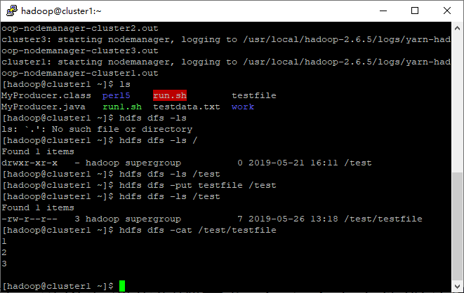

数据采集与存储

| 学 号：    | 16281002             |
|------------|----------------------|
| 姓 名：    | 杜永坤               |
| 专 业：    | 计算机科学与技术     |
| 学 院：    | 计算机与信息技术学院 |
|            |                      |
|            |                      |
| 提交日期： | 2019年05月27日       |

**实验二**

数据采集存储实验

实验目的 
=========

1.  理解Kafka、HDFS、HBase、Hive在Hadoop体系结构中的角色；

2.  熟悉HDFS、Hbase操作常用的Shell命令；

3.  熟悉HDFS、HBase操作常用的Java API;

4.  熟悉Hive的DDL命令与DML操作;

实验环境 
=========

实验平台：基于实验一搭建的虚拟机Hadoop大数据实验平台上的KAFKA集群、HDFS、HBASE、HIVE；

编程语言：JAVA；

实验内容 
=========

3.1KAFKA数据采集
----------------

### 3.1.1使用Kafka Shell命令完成以下任务：

1.  创建任意topic

2.  创建向该topic发送数据的生产者

3.  创建订阅该topic的消费者

#### 创建topic

在cluster1上创建名称为mykafka的topic，查看信息

#### 生产者

在cluster1上使用Kafka-console-producer.sh，创建producer，这终端就是输入源

#### 消费者

在cluster2上使用

Kafka-console-consumer.sh，创建consumer，终端显示producer在终端输入的信息

分别在cluster2cluster1上使用Ctrl+C退出。

退出后终端会显示传输内容的信息：

### 3.1.2使用Java API编程实现以下任务：

1.  实现生产者程序，向指定topic发送数据

2.  实现消费者程序，从（1）中指定的topic中订阅数据并将消费得到的数据存到本地文件中。

#### 生产者：

Java代码：

>   *import java.io.BufferedReader;*

>   *import java.io.File;*

>   *import java.io.FileReader;*

>   *import java.io.IOException;*

>   *import java.util.Properties;*

>   *import kafka.javaapi.producer.Producer;*

>   *import kafka.producer.KeyedMessage;*

>   *import kafka.producer.ProducerConfig;*

>   *public class MyProducer {*

>   *public static void main(String[] args) {*

>   *Properties props = new Properties();*

>   *props.put("serializer.class", "kafka.serializer.StringEncoder");*

>   *props.put("metadata.broker.list", "localhost:9092");*

>   *Producer\<Integer, String\> producer = new Producer\<Integer, String\>(new
>   ProducerConfig(props));*

>   *String topic = "mykafka";*

>   *File file = new File("testdata.txt");*

>   *BufferedReader reader = null;*

>   *try {*

>   *reader = new BufferedReader(new FileReader(file));*

>   *String tempString = null;*

>   *int line = 1;*

>   *while ((tempString = reader.readLine()) != null) {*

>   *producer.send(new KeyedMessage\<Integer, String\>(topic, tempString));*

>   *System.out.println("Success send [" + line + "] message ..");*

>   *line++;*

>   *}*

>   *reader.close();*

>   *System.out.println("Total send [" + line + "] messages ..");*

>   *} catch (Exception e) {*

>   *e.printStackTrace();*

>   *} finally {*

>   *if (reader != null) {*

>   *try {*

>   *reader.close();*

>   *} catch (IOException e1) {}*

>   *}*

>   *}*

>   *producer.close();*

>   *}*

>   *}*

编译javac -cp /usr/local/kafka_2.10-0.8.2.1/libs/\*: MyProducer.java

执行java -cp /usr/local/kafka_2.10-0.8.2.1/libs/\*: MyProducer

#### 消费者：

>   *import java.util.HashMap;*

>   *import java.util.List;*

>   *import java.util.Map;*

>   *import java.util.Properties;*

>   *import java.io.File;*

>   *import java.io.FileNotFoundException;*

>   *import java.io.FileReader;*

>   *import java.io.FileWriter;*

>   *import kafka.consumer.Consumer;*

>   *import kafka.consumer.ConsumerConfig;*

>   *import kafka.consumer.ConsumerIterator;*

>   *import kafka.consumer.KafkaStream;*

>   *import kafka.javaapi.consumer.ConsumerConnector;*

>   *public class MyConsumer {*

>   *public static void main(String[] args) {*

>   *File fp = new File("testdata1.txt");*

>   *static FileWriter fw = null;*

>   *try {*

>   *if (!fp.exists()) {*

>   *fp.createNewFile(); // 创建输出的中间文件*

>   *}*

>   *fw = new FileWriter(fp);*

>   *} catch (IOException e) {*

>   *// TODO Auto-generated catch block*

>   *e.printStackTrace();*

>   *}*

>   *String topic = "mykafka";*

>   *ConsumerConnector consumer =
>   Consumer.createJavaConsumerConnector(createConsumerConfig());*

>   *Map\<String, Integer\> topicCountMap = new HashMap\<String, Integer\>();*

>   *topicCountMap.put(topic, new Integer(1));*

>   *Map\<String, List\<KafkaStream\<byte[], byte[]\>\>\> consumerMap =
>   consumer.createMessageStreams(topicCountMap);*

>   *KafkaStream\<byte[], byte[]\> stream = consumerMap.get(topic).get(0);*

>   *ConsumerIterator\<byte[], byte[]\> it = stream.iterator();*

>   *while(it.hasNext())*

>   *{try {*

>   *fw.write(new String(it.next().message()));*

>   *} catch (IOException e) {*

>   *// TODO Auto-generated catch block*

>   *e.printStackTrace();*

>   *}*

>   *System.out.println("consume: " + new String(it.next().message()));*

>   *}*

>   *}*

>   *private static ConsumerConfig createConsumerConfig() {*

>   *Properties props = new Properties();*

>   *props.put("group.id","group1");*

>   *props.put("zookeeper.connect","cluster1:2181,cluster2:2181,cluster3:2181");*

>   *props.put("zookeeper.session.timeout.ms", "400");*

>   *props.put("zookeeper.sync.time.ms", "200");*

>   *props.put("auto.commit.interval.ms", "1000");*

>   *return new ConsumerConfig(props);*

>   *}*

>   *}*

编译javac -cp /usr/local/kafka_2.10-0.8.2.1/libs/\*: MyConsumer.java

执行java -cp /usr/local/kafka_2.10-0.8.2.1/libs/\*: MyConsumer

#### 结果展示：

运行过程中：

Cluster1运行生产者的程序，从数据集中获得数据，然后上传到topic，然后cluster2上运行了消费者程序，消费topic的数据，并将数据保存到了本地。

运行结束后：

Cluster2上多出保存数据的文件：  

3.2数据集介绍
-------------

>   本课程所选用的数据集由中国航信提供，是真实GDS系统预定日志。其中包日志数据分组标识，日志类型，时间戳等类型，每一行数据对应一条日志。数据样例如下：

3.2.HDFS数据存储
----------------

1.  利用Hadoop提供的Shell命令完成以下任务：

2.  向HDFS中上传任意文本文件，如果指定的文件在HDFS中已经存在，由用户指定是追加到原有文件末尾还是覆盖原有的文件；

>   先 上传一个测试文件testfile，内容如下：

修改本地testfile的内容为456

>   先是设定为追加：

>   执行命令后查看testfile内容

>   然后是覆盖直接使用put -f命令即可

Java API实现：

>   *import java.io.FileInputStream;*

>   *import java.io.IOException;*

>   *import org.apache.hadoop.conf.Configuration;*

>   *import org.apache.hadoop.fs.FSDataOutputStream;*

>   *import org.apache.hadoop.fs.FileSystem;*

>   *import org.apache.hadoop.fs.Path;*

>   *public class CopyFromLocalFile {*

>   */\*\**

>   *\* 判断路径是否存在*

>   *\*/*

>   *public static boolean test(Configuration conf, String path) {*

>   *try (FileSystem fs = FileSystem.get(conf)) {*

>   *return fs.exists(new Path(path));*

>   *} catch (IOException e) {*

>   *e.printStackTrace();*

>   *return false;*

>   *}*

>   *}*

>   */\*\**

>   *\* 复制文件到指定路径 若路径已存在，则进行覆盖*

>   *\*/*

>   *public static void copyFromLocalFile(Configuration conf,*

>   *String localFilePath, String remoteFilePath) {*

>   *Path localPath = new Path(localFilePath);*

>   *Path remotePath = new Path(remoteFilePath);*

>   *try (FileSystem fs = FileSystem.get(conf)) {*

>   */\* fs.copyFromLocalFile
>   第一个参数表示是否删除源文件，第二个参数表示是否覆盖 \*/*

>   *fs.copyFromLocalFile(false, true, localPath, remotePath);*

>   *} catch (IOException e) {*

>   *e.printStackTrace();*

>   *}*

>   *}*

>   */\*\**

>   *\* 追加文件内容*

>   *\*/*

>   *public static void appendToFile(Configuration conf, String localFilePath,*

>   *String remoteFilePath) {*

>   *Path remotePath = new Path(remoteFilePath);*

>   *try (FileSystem fs = FileSystem.get(conf);*

>   *FileInputStream in = new FileInputStream(localFilePath);) {*

>   *FSDataOutputStream out = fs.append(remotePath);*

>   *byte[] data = new byte[1024];*

>   *int read = -1;*

>   *while ((read = in.read(data)) \> 0) {*

>   *out.write(data, 0, read);*

>   *}*

>   *out.close();*

>   *} catch (IOException e) {*

>   *e.printStackTrace();*

>   *}*

>   *}*

>   */\*\**

>   *\* 主函数*

>   *\*/*

>   *public static void main(String[] args) {*

>   *Configuration conf = new Configuration();*

>   *conf.set("fs.defaultFS", "hdfs://localhost:9000");*

>   *String localFilePath = "/home/hadoop/textfile"; // 本地路径*

>   *String remoteFilePath = "/test/textfile"; // HDFS路径*

>   *// String choice = "append"; // 若文件存在则追加到文件末尾*

>   *String choice = "overwrite"; // 若文件存在则覆盖*

>   *try {*

>   */\* 判断文件是否存在 \*/*

>   *boolean fileExists = false;*

>   *if (CopyFromLocalFile.test(conf, remoteFilePath)) {*

>   *fileExists = true;*

>   *System.out.println(remoteFilePath + " 已存在.");*

>   *} else {*

>   *System.out.println(remoteFilePath + " 不存在.");*

>   *}*

>   */\* 进行处理 \*/*

>   *if (!fileExists) { // 文件不存在，则上传*

>   *CopyFromLocalFile.copyFromLocalFile(conf, localFilePath,*

>   *remoteFilePath);*

>   *System.out.println(localFilePath + " 已上传至 " + remoteFilePath);*

>   *} else if (choice.equals("overwrite")) { // 选择覆盖*

>   *CopyFromLocalFile.copyFromLocalFile(conf, localFilePath,*

>   *remoteFilePath);*

>   *System.out.println(localFilePath + " 已覆盖 " + remoteFilePath);*

>   *} else if (choice.equals("append")) { // 选择追加*

>   *CopyFromLocalFile.appendToFile(conf, localFilePath,*

>   *remoteFilePath);*

>   *System.out.println(localFilePath + " 已追加至 " + remoteFilePath);*

>   *}*

>   *} catch (Exception e) {*

>   *e.printStackTrace();*

>   *}*

>   *}*

>   *}*

1.  从HDFS中下载指定文件，如果本地文件与要下载的文件名称相同，则自动对下载的文件重命名；

可以看到本地存在testfile文件，执行命令后，新下载的文件被命名为testfile2

JavaAPI实现：

>   *import org.apache.hadoop.conf.Configuration;*

>   *import org.apache.hadoop.fs.\*;*

>   *import org.apache.hadoop.fs.FileSystem;*

>   *import java.io.\*;*

>   *public class CopyToLocal {*

>   */\*\**

>   *\* 下载文件到本地 判断本地路径是否已存在，若已存在，则自动进行重命名*

>   *\*/*

>   *public static void copyToLocal(Configuration conf, String remoteFilePath,*

>   *String localFilePath) {*

>   *Path remotePath = new Path(remoteFilePath);*

>   *try (FileSystem fs = FileSystem.get(conf)) {*

>   *File f = new File(localFilePath);*

>   */\* 如果文件名存在，自动重命名(在文件名后面加上 \_0, \_1 ...) \*/*

>   *if (f.exists()) {*

>   *System.out.println(localFilePath + " 已存在.");*

>   *Integer i = Integer.valueOf(0);*

>   *while (true) {*

>   *f = new File(localFilePath + "_" + i.toString());*

>   *if (!f.exists()) {*

>   *localFilePath = localFilePath + "_" + i.toString();*

>   *break;*

>   *} else {*

>   *i++;*

>   *continue;*

>   *}*

>   *}*

>   *System.out.println("将重新命名为: " + localFilePath);*

>   *}*

>   *// 下载文件到本地*

>   *Path localPath = new Path(localFilePath);*

>   *fs.copyToLocalFile(remotePath, localPath);*

>   *} catch (IOException e) {*

>   *// TODO Auto-generated catch block*

>   *e.printStackTrace();*

>   *}*

>   *}*

>   */\*\**

>   *\* 主函数*

>   *\*/*

>   *public static void main(String[] args) {*

>   *Configuration conf = new Configuration();*

>   *conf.set("fs.defaultFS", "hdfs://localhost:9000");*

>   *String localFilePath = "/home/hadoop/textfile"; // 本地路径*

>   *String remoteFilePath = "/test/textfile"; // HDFS路径*

>   *try {*

>   *CopyToLocal.copyToLocal(conf, remoteFilePath, localFilePath);*

>   *System.out.println("下载完成");*

>   *} catch (Exception e) {*

>   *e.printStackTrace();*

>   *}*

>   *}*

>   *}*

1.  显示HDFS中指定的文件的读写权限、大小、创建时间、路径等信息；

Java API实现：

>   *import org.apache.hadoop.conf.Configuration;*

>   *import org.apache.hadoop.fs.\*;*

>   *import org.apache.hadoop.fs.FileSystem;*

>   *import java.io.\*;*

>   *import java.text.SimpleDateFormat;*

>   *public class List {*

>   */\*\**

>   *\* 显示指定文件的信息*

>   *\*/*

>   *public static void ls(Configuration conf, String remoteFilePath) {*

>   *try (FileSystem fs = FileSystem.get(conf)) {*

>   *Path remotePath = new Path(remoteFilePath);*

>   *FileStatus[] fileStatuses = fs.listStatus(remotePath);*

>   *for (FileStatus s : fileStatuses) {*

>   *System.out.println("路径: " + s.getPath().toString());*

>   *System.out.println("权限: " + s.getPermission().toString());*

>   *System.out.println("大小: " + s.getLen());*

>   */\* 返回的是时间戳,转化为时间日期格式 \*/*

>   *long timeStamp = s.getModificationTime();*

>   *SimpleDateFormat format = new SimpleDateFormat(*

>   *"yyyy-MM-dd HH:mm:ss");*

>   *String date = format.format(timeStamp);*

>   *System.out.println("时间: " + date);*

>   *}*

>   *} catch (IOException e) {*

>   *e.printStackTrace();*

>   *}*

>   *}*

>   */\*\**

>   *\* 主函数*

>   *\*/*

>   *public static void main(String[] args) {*

>   *Configuration conf = new Configuration();*

>   *conf.set("fs.defaultFS", "hdfs://localhost:9000");*

>   *String remoteFilePath = "/test/textfile"; // HDFS路径*

>   *try {*

>   *System.out.println("读取文件信息: " + remoteFilePath);*

>   *List.ls(conf, remoteFilePath);*

>   *System.out.println("\\n读取完成");*

>   *} catch (Exception e) {*

>   *e.printStackTrace();*

>   *}*

>   *}*

>   *}*

1.  给定HDFS中某一个目录，输出该目录下的所有文件的读写权限、大小、创建时间、路径等信息，如果该文件是目录，则递归输出该目录下所有文件相关信息；

Java API实现：

>   *import org.apache.hadoop.conf.Configuration;*

>   *import org.apache.hadoop.fs.\*;*

>   *import org.apache.hadoop.fs.FileSystem;*

>   *import java.io.\*;*

>   *import java.text.SimpleDateFormat;*

>   *public class ListDir {*

>   */\*\**

>   *\* 显示指定文件夹下所有文件的信息（递归）*

>   *\*/*

>   *public static void lsDir(Configuration conf, String remoteDir) {*

>   *try (FileSystem fs = FileSystem.get(conf)) {*

>   *Path dirPath = new Path(remoteDir);*

>   */\* 递归获取目录下的所有文件 \*/*

>   *RemoteIterator\<LocatedFileStatus\> remoteIterator = fs.listFiles(*

>   *dirPath, true);*

>   */\* 输出每个文件的信息 \*/*

>   *while (remoteIterator.hasNext()) {*

>   *FileStatus s = remoteIterator.next();*

>   *System.out.println("路径: " + s.getPath().toString());*

>   *System.out.println("权限: " + s.getPermission().toString());*

>   *System.out.println("大小: " + s.getLen());*

>   */\* 返回的是时间戳,转化为时间日期格式 \*/*

>   *Long timeStamp = s.getModificationTime();*

>   *SimpleDateFormat format = new SimpleDateFormat(*

>   *"yyyy-MM-dd HH:mm:ss");*

>   *String date = format.format(timeStamp);*

>   *System.out.println("时间: " + date);*

>   *System.out.println();*

>   *}*

>   *} catch (IOException e) {*

>   *e.printStackTrace();*

>   *}*

>   *}*

>   */\*\**

>   *\* 主函数*

>   *\*/*

>   *public static void main(String[] args) {*

>   *Configuration conf = new Configuration();*

>   *conf.set("fs.defaultFS", "hdfs://localhost:9000");*

>   *String remoteDir = "/"; // HDFS路径*

>   *try {*

>   *System.out.println("(递归)读取目录下所有文件的信息: " + remoteDir);*

>   *ListDir.lsDir(conf, remoteDir);*

>   *System.out.println("读取完成");*

>   *} catch (Exception e) {*

>   *e.printStackTrace();*

>   *}*

>   *}*

>   *}*

1.  删除HDFS中指定的文件；

hdfs dfs -rm /test/testfile

1.  在HDFS中，将文件从源路径移动到目的路径。

hdfs dfs -mv testfile /usr/hadoop/

JavaAPI实现：

>   *import org.apache.hadoop.conf.Configuration;*

>   *import org.apache.hadoop.fs.\*;*

>   *import org.apache.hadoop.fs.FileSystem;*

>   *import java.io.\*;*

>   *public class MoveFile {*

>   */\*\**

>   *\* 移动文件*

>   *\*/*

>   *public static boolean mv(Configuration conf, String remoteFilePath,*

>   *String remoteToFilePath) {*

>   *try (FileSystem fs = FileSystem.get(conf)) {*

>   *Path srcPath = new Path(remoteFilePath);*

>   *Path dstPath = new Path(remoteToFilePath);*

>   *return fs.rename(srcPath, dstPath);*

>   *} catch (IOException e) {*

>   *e.printStackTrace();*

>   *return false;*

>   *}*

>   *}*

>   */\*\**

>   *\* 主函数*

>   *\*/*

>   *public static void main(String[] args) {*

>   *Configuration conf = new Configuration();*

>   *conf.set("fs.defaultFS", "hdfs://localhost:9000");*

>   *String remoteFilePath = "/test/testfile"; // 源文件HDFS路径*

>   *String remoteToFilePath = "/usr/hadoop/"; // 目的HDFS路径*

>   *try {*

>   *if (MoveFile.mv(conf, remoteFilePath, remoteToFilePath)) {*

>   *System.out.println("将文件 " + remoteFilePath + " 移动到 "*

>   *+ remoteToFilePath);*

>   *} else {*

>   *System.out.println("操作失败(源文件不存在或移动失败)");*

>   *}*

>   *} catch (Exception e) {*

>   *e.printStackTrace();*

>   *}*

>   *}*

>   *}*

3.3.HBASE数据存储
-----------------

1.  通过Hbase的shell命令创建HBase列式存储数据表格，其中每一行的数据格式如下：

| 行键(number) | 列簇1(information) | 列簇2(score) |           |              |              |              |
|--------------|--------------------|--------------|-----------|--------------|--------------|--------------|
|              | 列名(name)         | 列名(sex)    | 列名(age) | 列名(123001) | 列名(123002) | 列名(123003) |
| 学号         | 姓名               | 性别         | 年龄      | 成绩         | 成绩         | 成绩         |

首先进入HBase

HBase shell

然后创建表：

create 'student','information','score'

查看表：

1.  请使用HBASE提供的API编程，实现向1)
    建立的HBase表中插入如下数据，并完成以下指定功能：

学生表（Student）

| 学号（S_No） | 姓名（S_Name） | 性别（S_Sex） | 年龄（S_Age） |
|--------------|----------------|---------------|---------------|
| 2015001      | Zhangsan       | male          | 23            |
| 2015002      | Mary           | female        | 22            |
| 2015003      | Lisi           | male          | 24            |

选课表（SC）

| 学号（SC_Sno） | 课程号（SC_Cno） | 成绩（SC_Score） |
|----------------|------------------|------------------|
| 2015001        | 123001           | 86               |
| 2015001        | 123003           | 69               |
| 2015002        | 123002           | 77               |
| 2015002        | 123003           | 99               |
| 2015003        | 123001           | 98               |
| 2015003        | 123002           | 95               |

1.  addRecord(String tableName, String row, String[] fields, String[]
    values);向表tableName、行row（用S_Name表示）和字符串数组files指定的单元格中添加对应的数据values。其中fields中每个元素如果对应的列族下还有相应的列限定符的话，用“columnFamily:column”表示。例如，同时向“Math”、“Computer
    Science”、“English”三列添加成绩时，字符串数组fields为{“Score:Math”,”Score；Computer
    Science”,”Score:English”}，数组values存储这三门课的成绩。

2.  scanColumn(String tableName, String
    column);浏览表tableName某一列的数据，如果某一行记录中该列数据不存在，则返回null。要求当参数column为某一列族名称时，如果底下有若干个列限定符，则要列出每个列限定符代表的列的数据；当参数column为某一列具体名称（例如“Score:Math”）时，只需要列出该列的数据。

3.  deleteRow(String tableName, String row);删除表tableName中row指定的行的记录。

Java API程序：

>   */\**

>   *\* 创建一个students表,并进行相关操作*

>   *\*/*

>   *import java.io.IOException;*

>   *import java.util.ArrayList;*

>   *import java.util.List;*

>   *import org.apache.hadoop.conf.Configuration;*

>   *import org.apache.hadoop.hbase.HBaseConfiguration;*

>   *import org.apache.hadoop.hbase.HColumnDescriptor;*

>   *import org.apache.hadoop.hbase.HTableDescriptor;*

>   *import org.apache.hadoop.hbase.KeyValue;*

>   *import org.apache.hadoop.hbase.client.Delete;*

>   *import org.apache.hadoop.hbase.client.Get;*

>   *import org.apache.hadoop.hbase.client.HBaseAdmin;*

>   *import org.apache.hadoop.hbase.client.HTable;*

>   *import org.apache.hadoop.hbase.client.Put;*

>   *import org.apache.hadoop.hbase.client.Result;*

>   *import org.apache.hadoop.hbase.client.ResultScanner;*

>   *import org.apache.hadoop.hbase.client.Scan;*

>   *import org.apache.hadoop.hbase.util.Bytes;*

>   *public class HBaseJavaAPI {*

>   *// 声明静态配置*

>   *private static Configuration conf = null;*

>   *static {*

>   *conf = HBaseConfiguration.create();*

>   *conf.set("hbase.zookeeper.quorum", "192.168.56.121");*

>   *conf.set("hbase.zookeeper.property.clientPort", "2181");*

>   *}*

>   *//判断表是否存在*

>   *private static boolean isExist(String tableName) throws IOException {*

>   *HBaseAdmin hAdmin = new HBaseAdmin(conf);*

>   *return hAdmin.tableExists(tableName);*

>   *}*

>   *// 创建数据库表*

>   *public static void createTable(String tableName, String[] columnFamilys)*

>   *throws Exception {*

>   *// 新建一个数据库管理员*

>   *HBaseAdmin hAdmin = new HBaseAdmin(conf);*

>   *if (hAdmin.tableExists(tableName)) {*

>   *System.out.println("表 "+tableName+" 已存在！");*

>   *//System.exit(0);*

>   *} else {*

>   *// 新建一个students表的描述*

>   *HTableDescriptor tableDesc = new HTableDescriptor(tableName);*

>   *// 在描述里添加列族*

>   *for (String columnFamily : columnFamilys) {*

>   *tableDesc.addFamily(new HColumnDescriptor(columnFamily));*

>   *}*

>   *// 根据配置好的描述建表*

>   *hAdmin.createTable(tableDesc);*

>   *System.out.println("创建表 "+tableName+" 成功!");*

>   *}*

>   *}*

>   *// 删除数据库表*

>   *public static void deleteTable(String tableName) throws Exception {*

>   *// 新建一个数据库管理员*

>   *HBaseAdmin hAdmin = new HBaseAdmin(conf);*

>   *if (hAdmin.tableExists(tableName)) {*

>   *// 关闭一个表*

>   *hAdmin.disableTable(tableName);*

>   *hAdmin.deleteTable(tableName);*

>   *System.out.println("删除表 "+tableName+" 成功！");*

>   *} else {*

>   *System.out.println("删除的表 "+tableName+" 不存在！");*

>   *System.exit(0);*

>   *}*

>   *}*

>   *// 添加一条数据*

>   *public static void addRecord(String tableName, String row,*

>   *String columnFamily, String column, String value) throws Exception {*

>   *HTable table = new HTable(conf, tableName);*

>   *Put put = new Put(Bytes.toBytes(row));// 指定行*

>   *// 参数分别:列族、列、值*

>   *put.add(Bytes.toBytes(columnFamily), Bytes.toBytes(column),*

>   *Bytes.toBytes(value));*

>   *table.put(put);*

>   *}*

>   *// 删除一条(行)数据*

>   *public static void deleteRow(String tableName, String row) throws Exception
>   {*

>   *HTable table = new HTable(conf, tableName);*

>   *Delete del = new Delete(Bytes.toBytes(row));*

>   *table.delete(del);*

>   *}*

>   *// 删除多条数据*

>   *public static void delMultiRows(String tableName, String[] rows)*

>   *throws Exception {*

>   *HTable table = new HTable(conf, tableName);*

>   *List\<Delete\> delList = new ArrayList\<Delete\>();*

>   *for (String row : rows) {*

>   *Delete del = new Delete(Bytes.toBytes(row));*

>   *delList.add(del);*

>   *}*

>   *table.delete(delList);*

>   *}*

>   *// 获取一条数据*

>   *public static void scanColumn(String tableName, String row) throws
>   Exception {*

>   *HTable table = new HTable(conf, tableName);*

>   *Get get = new Get(Bytes.toBytes(row));*

>   *Result result = table.get(get);*

>   *// 输出结果,raw方法返回所有keyvalue数组*

>   *for (KeyValue rowKV : result.raw()) {*

>   *System.out.print("行名:" + new String(rowKV.scanColumn()) + " ");*

>   *System.out.print("时间戳:" + rowKV.getTimestamp() + " ");*

>   *System.out.print("列族名:" + new String(rowKV.getFamily()) + " ");*

>   *System.out.print("列名:" + new String(rowKV.getQualifier()) + " ");*

>   *System.out.println("值:" + new String(rowKV.getValue()));*

>   *}*

>   *}*

>   *// 获取所有数据*

>   *public static void getAllRows(String tableName) throws Exception {*

>   *HTable table = new HTable(conf, tableName);*

>   *Scan scan = new Scan();*

>   *ResultScanner results = table.getScanner(scan);*

>   *// 输出结果*

>   *for (Result result : results) {*

>   *for (KeyValue rowKV : result.raw()) {*

>   *System.out.print("行名:" + new String(rowKV.scanColumn()) + " ");*

>   *System.out.print("时间戳:" + rowKV.getTimestamp() + " ");*

>   *System.out.print("列族名:" + new String(rowKV.getFamily()) + " ");*

>   *System.out*

>   *.print("列名:" + new String(rowKV.getQualifier()) + " ");*

>   *System.out.println("值:" + new String(rowKV.getValue()));*

>   *}*

>   *}*

>   *}*

>   *// 主函数*

>   *public static void main(String[] args) {*

>   *try {*

>   *String tableName = "student";*

>   *// 第一步：创建数据库表：“student”*

>   *String[] columnFamilys = { "information", "score" };*

>   *HBaseJavaAPI.createTable(tableName, columnFamilys);*

>   *// 第二步：向数据表的添加数据*

>   *// 添加第一行数据*

>   *if (isExist(tableName)) {*

>   *HBaseJavaAPI.addRecord(tableName, "2015000", "information", "name",
>   "dyk");*

>   *HBaseJavaAPI.addRecord(tableName, "2015000", "information", "age", "20");*

>   *HBaseJavaAPI.addRecord(tableName, "2015000", "information", "sex", "boy");*

>   *HBaseJavaAPI.addRecord(tableName, "2015000", "score", "123001", "97");*

>   *HBaseJavaAPI.addRecord(tableName, "2015000", "score", "123002", "128");*

>   *HBaseJavaAPI.addRecord(tableName, "2015000", "score", "123003", "85");*

>   *// 添加第二行数据*

>   *HBaseJavaAPI.addRecord(tableName, "2015001", "information", "name",
>   "zhangsan");*

>   *HBaseJavaAPI.addRecord(tableName, "2015001", "information", "age", "23");*

>   *HBaseJavaAPI.addRecord(tableName, "2015001", "information", "sex",
>   "male");*

>   *HBaseJavaAPI.addRecord(tableName, "2015001", "score", "123001","86");*

>   *HBaseJavaAPI.addRecord(tableName, "2015001", "score", "123003","69");*

>   *//HBaseJavaAPI.addRecord(tableName, "2015001", "score", "123002","90");*

>   *// 添加第三行数据*

>   *HBaseJavaAPI.addRecord(tableName, "2015002", "information", "name",
>   "Mary");*

>   *HBaseJavaAPI.addRecord(tableName, "2015002", "information", "age", "22");*

>   *HBaseJavaAPI.addRecord(tableName, "2015002", "information",
>   "sex","female");*

>   *HBaseJavaAPI.addRecord(tableName, "2015002", "score", "123002","77");*

>   *HBaseJavaAPI.addRecord(tableName, "2015002", "score", "123003","99");*

>   *//HBaseJavaAPI.addRecord(tableName, "2015002", "score", "english","99");*

>   *HBaseJavaAPI.addRecord(tableName, "2015003", "information", "name",
>   "Lisi");*

>   *HBaseJavaAPI.addRecord(tableName, "2015003", "information", "age", "24");*

>   *HBaseJavaAPI.addRecord(tableName, "2015003", "information", "sex","male");*

>   *HBaseJavaAPI.addRecord(tableName, "2015003", "score", "123001","98");*

>   *HBaseJavaAPI.addRecord(tableName, "2015003", "score", "123002","95");*

>   *// 第三步：获取一条数据*

>   *System.out.println("\*\*\*\*\*\*\*\*\*\*\*\*\*\*获取一条(2015000)数据\*\*\*\*\*\*\*\*\*\*\*\*\*");*

>   *HBaseJavaAPI.scanColumn(tableName, "2015000");*

>   *// 第四步：获取所有数据*

>   *System.out.println("\*\*\*\*\*\*\*\*\*\*\*\*\*\*获取所有数据\*\*\*\*\*\*\*\*\*\*\*\*\*\*\*");*

>   *HBaseJavaAPI.getAllRows(tableName);*

>   *// 第五步：删除一条数据*

>   *System.out.println("\*\*\*\*\*\*\*\*\*\*\*\*删除一条(2015000)数据\*\*\*\*\*\*\*\*\*\*\*\*");*

>   *HBaseJavaAPI.deleteRow(tableName, "2015000");*

>   *HBaseJavaAPI.getAllRows(tableName);*

>   *// 第六步：删除多条数据*

>   *//System.out.println("\*\*\*\*\*\*\*\*\*\*\*\*\*\*删除多条数据\*\*\*\*\*\*\*\*\*\*\*\*\*\*\*");*

>   *//String rows[] = new String[] { "qingqing","xiaoxue" };*

>   *//HBaseJavaAPI.delMultiRows(tableName, rows);*

>   *//HBaseJavaAPI.getAllRows(tableName);*

>   *// 第七步：删除数据库*

>   *//System.out.println("\*\*\*\*\*\*\*\*\*\*\*\*\*\*\*删除数据库表\*\*\*\*\*\*\*\*\*\*\*\*\*\*");*

>   *//HBaseJavaAPI.deleteTable(tableName);*

>   *//System.out.println("表"+tableName+"存在吗？"+isExist(tableName));*

>   *} else {*

>   *System.out.println(tableName + "此数据库表不存在！");*

>   *}*

>   *} catch (Exception e) {*

>   *e.printStackTrace();*

>   *}*

>   *}*

>   *}*

编译：javac -cp /usr/local/hbase-1.2.6/lib/\*: HBaseJavaAPI.java

运行：java -cp /usr/local/hbase-1.2.6/lib/\*: HBaseJavaAPI

运行结果：

3.4.HIVE数据存储（可选）
------------------------

### 3.4.1使用shell命令完成下列任务

1.  任意创建一张表，先加载本地数据到该表；再查询该表，将结果输出到文件系统。

>   创建表：

>   create table test_table(id int, name string)row format delimited fields
>   terminated by '\\t';

>   创建table.txt文件，

>   内容为：

使用load语句：

LOAD DATA LOCAL INPATH "/home/hadoop/table.txt" OVERWRITE INTO TABLE test_table;

查看表：

Select \* from test_table;

1.  分别创建一个内部表，外部表，查看数据的存储位置，体会它们的区别。

创建内部表：

create table t1(

id int

,name string

,hobby array\<string\>

,add map\<String,string\>

)

row format delimited

fields terminated by ','

collection items terminated by '-'

map keys terminated by ':'

;

创建外部表：

create external table t2(

id int

,name string

,hobby array\<string\>

,add map\<String,string\>

)

row format delimited

fields terminated by ','

collection items terminated by '-'

map keys terminated by ':'

location '/user/t2'

;

查看来两个表的信息：  
内部表：  

外部表：

未被external修饰的是内部表（managed table），被external修饰的为外部表（external
table）；内部表和外部表的区别主要是，内部表数据由Hive自身管理，外部表数据由HDFS管理；内部表数据存储的位置是hive.metastore.warehouse.dir（默认：/user/hive/warehouse），外部表数据的存储位置由自己制定；删除内部表会直接删除元数据（metadata）及存储数据；删除外部表仅仅会删除元数据，HDFS上的文件并不会被删除；对内部表的修改会将修改直接同步给元数据，而对外部表的表结构和分区进行修改，则需要修复（MSCK
REPAIR TABLE table_name;）

1.  列出hive指定的表的相关信息，例如表名，结构信息等；

desc formatted table_name;

1.  清空指定的表的所有记录数据；

truncate table test_table;

问题解决
========

Kafka JAVA API jar包引用问题
----------------------------

使用java
API需要导入kafka的jar包，在开始实验的时候，对于jdk不容易管理jar包，这个过程中使用maven进行了实验，但是在CentOS上，没有用户界面，对于维护一个项目很不容易，其中也遇到很多问题，版本覆盖等等，这让第一步编译就进行不下去，后面还是采用了jdk引用外部包的方法：

javac -cp /usr/local/kafka_2.10-0.8.2.1/libs/\*: MyConsumer.java

这个命令可以将kafka/libs/目录下的所有jar包全部引用。

同理如果使用某个其他文件目录的jar包，修改对应的目录即可。

启动HDFS datanode启动失败问题
-----------------------------

>   启动HDFS的时候遇到datanode不能启动的问题：

>   主要的原因就是多次格式化HDFS:

>   接下来开始格式化：

>   // 启动journalnode（在所有datanode上执行，也就是cluster1, cluster2,
>   cluster3）

>   \$ hadoop-daemon.sh start journalnode

>   启动后使用jps命令可以看到JournalNode进程

>   // 格式化HDFS（在cluster1上执行）

>   \$ hdfs namenode -format

>   // 格式化完毕后可关闭journalnode（在所有datanode上执行）

>   \$ hadoop-daemon.sh stop journalnode

>   格式化只需要在第一次启动的时候进行一次即可。如果需要格式化，需要将

>   \<property\>

>   \<name\>dfs.datanode.data.dir\</name\>

>   \<value\>/home/hadoop_files/hadoop_data/hadoop/datanode\</value\>

>   \</property\>

该目录下的current文件夹删除掉，所有的节点上都要删除
